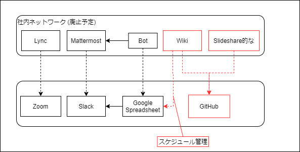

## 背景

本勉強会は社内勉強会として開催していたたため、連絡や情報共有は社内ネットワーク内に立てた各種サービスにより行っていた。しかし、参加者の退職や社内ネットワークに繋げない環境への異動などにより、社内ネットワーク内に立てたサービスにアクセスできないメンバが増えてきた。
連絡手段についてはSlackを、発表時の配信にはZoom利用することで社外からでも変わらず参加できるようにはなったが、発表資料を記録したり、発表に対するコメントを行っているサービスが未だに社内に残っているため、発表の記録を残すのが難しくなってきた。

そのため、発表の記録を残すシステムを社外に構築する必要がある。

## 発表記録に関するイベント

### 1. 発表内容を記録する

* 目的
  * 参加できなかった人でも発表内容を参照できるようにする
  * 後から発表内容を確認できるようにする
    * いつ、誰が、何を発表したか
    * 発表資料
* 要件
  * 発表資料を直接添付できなくとも、Slideshare/SpeakerDeck等の発表資料へのリンクが貼れれば良い
  * テンプレート等で入力サポートが出来ると良い
  * 参加者が発表内容を記録した場合、その通知がSlackへ飛ばせると良い
  * コミュニケーションの中心がSlackのため、Slackから発表内容を登録できると良い

### 2. 発表内容に対してコメントする

* 目的
  * 発表者のモチベーション維持
  * 発表内容の深堀
* 要件
  * コメント内容について規程は無い
  * 誰がコメントしたかが分かると良い
  * コメントに返信する場合、どのコメントへ返信したかわかると良い
  * コメントがあった場合にSlackへ通知できると良い
    * コメントがあったことを発表者/参加者が認知できるため

### 3. 発表スケジュールを管理する

* 目的
  * 資料作成についてのスケジュール感の把握
  * 発表者の把握
* 要件
  * ローテーションで行っているため、参加者リストから自動で生成できると良い
  * 年末年始やお盆など、祝日ではないが開催しないという場合などが管理できると良い
  * 中止になった場合に一周ずらす仕組みがあると良い

## 構成案

### GitHub Issues (イベント1,2)

* **発表者**
  * 自分の発表に関するIssueを作成する
    * **タイトル**: YYYY-MM-DD [タイトル]
    * **Assign**: 自分
    * **内容**:
      * 資料(or 資料へのリンク)
      * 発表概要
      * 備考
  * 発表内容を修正したい場合はIssueの編集を行う
  * 参加者からコメントがあった場合、`@`メンション・`> ` による引用などを使用して返信する 
* **参加者**
  * 発表者の作成したIssueに対してコメント/リアクションを行う

* TODO
  - [ ] GitHub IssueイベントをSlackへ飛ばせるか
  - [ ] Issueテンプレートの作成

* Why not?
  * **GitHub Wiki**
    * コメントが管理できないため不適
    * また、無償ユーザーの場合Private Repositoryでは使用できない
  * **Git Repository**
    * 発表内容の管理に履歴管理は不要であり、オーバースペックだと思われるため不適

### Google Spreadsheet (イベント3)

* **管理者**
  * 参加者の追加/削除があった場合に参加者を管理しているシートを編集する
* TODO
  - [ ] 実現性の検証
  - [ ] スケジュールを確認するフローの妥当性検証

* Why not?
  * **GitHub Actions**
    * リポジトリに更新がないと定期的なActionの実行が停止されるため不適
      * https://docs.github.com/ja/actions/managing-workflow-runs/disabling-and-enabling-a-workflow
      * > 警告： 不必要なワークフローの実行を避けるために、スケジュールされたワークフローは自動的に無効化できます。 パブリックリポジトリがフォークされると、スケジュールされたワークフローはデフォルトで無効化されます。 パブリックリポジトリでは、60日間にリポジトリにアクティビティがなかった場合、スケジュールされたワークフローは自動的に無効化されます。
    * 定期的に更新するプロセスを入れられればいいが、そこまで想定できていない

## 調査内容

### GitHub

####  Private Repositoryの制約
上記で記述した運用上は無償ユーザーのPrivate Repositoryでも機能的には問題なさそう

https://github.com/pricing
* `Protected branches`
  * `master` ブランチへのPushを禁止することができない
  * そんなに使わないから良いか
* `Collaborators for private repositories`
  * 昔は3人までとかだったけど、無制限になった模様。良かった。
* `Pages and wikis`
  * 特に使用する予定は無いので問題ない

#### GitHubに添付できるファイルサイズの上限

Issueに添付できるファイルサイズの上限は 25MB。

[Attaching files \- GitHub Docs](https://docs.github.com/ja/github/writing-on-github/working-with-advanced-formatting/attaching-files)
> The maximum file size is:
>   10MB for images and gifs
>   10MB for videos uploaded to a repository owned by a user or organization on a free GitHub plan
>   100MB for videos uploaded to a repository owned by a user or organization on a paid GitHub plan
>   25MB for all other files

リポジトリ全体のIssueとしての上限ファイルサイズは不明。  
以下に100GBまでという記述はあるが、Gitリポジトリとしてのファイルサイズの事を言っている気もする。

[What is my disk quota? \- GitHub Help](https://web.archive.org/web/20200521202931/https://help.github.com/en/github/managing-large-files/what-is-my-disk-quota)
> Repositories have a hard size limit of 100GB. If you reach 75GB, you'll receive a warning from Git in your terminal the next time you push a change. 

#### Slack連携
[GitHub と Slack を連携させる \| Slack](https://slack.com/intl/ja-jp/help/articles/232289568-GitHub-%E3%81%A8-Slack-%E3%82%92%E9%80%A3%E6%90%BA%E3%81%95%E3%81%9B%E3%82%8B#slack-%E7%94%A8-github-%E3%82%A2%E3%83%97%E3%83%AA-1)

GitHubアプリを使用することで、Slack内の指定したチャンネルへイベントを通知することが可能。  
**comments**イベントはデフォルトで通知されないが、通知するよう設定も出来そう（要確認）

### Google Spreadsheet

[毎週発信で2年継続するCookpad Design Magazineのしくみ｜Miwa Kuramitsu｜note](https://note.com/hebereke/n/n747ac256733a)
> Google スプレッドシートに担当日がリストアップされています(なぜ2週間前、3日前について記載されているかは後述)。現在約30名のデザイナーがいるので、毎週金曜日公開で半年おきに当番が回ってくる頻度です。

ココを参考に。

やり方は後で調べる。